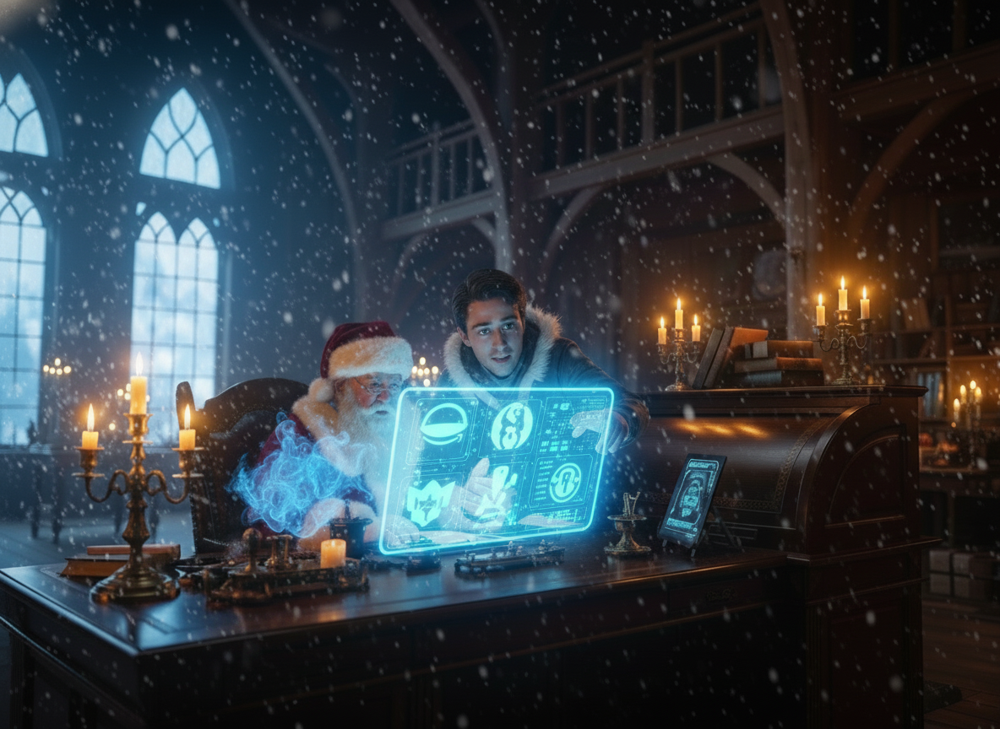
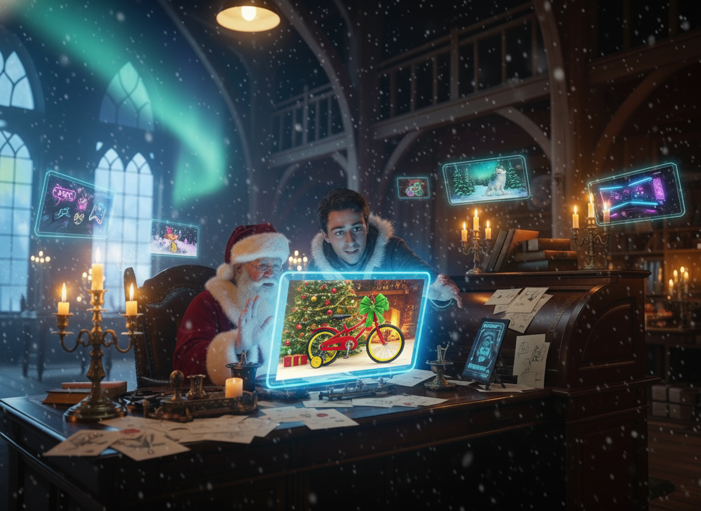

# 📖 The Chronicle of the Great Sleigh-Ride Migration

## Prologue: The Zenith of Chaos

The North Pole was unusually, unnervingly silent. Usually, by the first week of December, the air would be thick with the scent of pine shavings, hot cocoa, and the rhythmic *thump-clack* of a thousand wooden hammers. But today, the only sound was the howling wind rattling the frost-heavy windowpanes of Santa’s private study.

Santa Claus sat in his great oaken chair, staring at the fireplace where the embers were dying, casting long, shivering shadows across the floor. On his desk sat a massive copper bowl, usually overflowing with the morning’s mail. Now, it was empty. Not because the letters had stopped coming, but because they had stopped being *physical*.

"Not a single envelope," Santa whispered, his voice heavy with a weariness that went deeper than bone. "Millions of messages, drifting in the invisible winds of the 'Cloud', and I am but an old man with a quill who cannot even see them."

The Elves were gone, their workshops dark after a bitter dispute over candy-cane dental insurance. The Reindeer had vanished to the sun-bleached shores of Ibiza, leaving only a single postcard behind. Santa was alone with a mountain of digital chaos he didn't understand. The magic was fading, replaced by a cold, mechanical void.

## Chapter I: The Arrival of the Wayfarer

A sharp rap at the door broke the silence. Snow swirled into the room as the heavy oak door creaked open, revealing a figure wrapped in a travel-worn cloak of deep midnight blue.

"You look like you’ve reached the end of your rope, Sir," a voice said—a young voice, but one that carried the weight of someone who had traveled far through the digital storms.

"And who might you be?" Santa asked, squinting through the dim light.

"They call me the **Cloud Apprentice**," the figure replied, stepping into the warmth of the hearth. "I’ve seen the towers of Amazon and the great halls where data flows like molten gold. I heard the North Pole had fallen silent, and I came to see if we might build a new kind of workshop."

The Apprentice didn't reach for a hammer. Instead, they pulled a glowing Slate from their robes. In the days that followed, the workshop began to hum once more—not with the sound of saws, but with the soft, blue glow of digital magic manifesting in the **S3 Basins**—vast, shimmering pools where the world's digital letters gathered like falling stars.

"Look here, Santa," the Apprentice said, pointing at a letter from a boy named Lucas. It was a mess of strange symbols and digital noise. With a flick of the wrist, the Apprentice showed Santa how to use the 'Bedrock Spirits' to wipe away the static. "We are not just reading words anymore; we are extracting the *truth*."

They taught the spirits to organize the chaos into perfect digital ledgers. They even showed the spirits how to paint Sarah’s red racing bike—not with ink, but with the very light of the stars—creating cards that shimmered with personal magic. 

But as the volume grew, so did the complexity. One afternoon, a scroll manifested that was so long it felt like a never-ending river of text. "It's a ten-page manifesto from a child in New York," Santa sighed, rubbing his temples as the words blurred before him. "The spirits are overwhelmed; they cannot hold this much magic in a single thought."

"Then we shall teach them to breathe," the Apprentice replied. They introduced the magic of **Chunking**, slicing the massive scroll into manageable sections. The spirits summarized each piece in turn, before weaving them back into a single, perfect wish list. 

"We need a conscience for this magic," Santa insisted, his eyes flashing with old fire. And so, they built the **Validation Gate**, a filter made of pure ethics to protect the children.

## Chapter II: The Great Well of Memory

By the middle of the month, the snow lay ten feet deep against the workshop walls. Inside, the Apprentice and Santa sat before a massive, shimmering globe they called the **Vector Store**.

"It’s a well of memory, Santa," the Apprentice explained. "Every kindness recorded in the last ten years, every shared lunch, every scraped knee comforted—it’s all here, in a language the spirits can calculate."

A letter arrived from a boy named Timmy, who claimed to be the 'best boy in London.' Santa smiled, but the smile was tinged with doubt. "Let us see what the Well says."

They dipped their digital bucket into the Well. Seconds later, a vision appeared: Timmy sharing his favorite toy with a neighbor. "The memory is true," Santa breathed. "But look here—the spirits also found the time he painted his sister’s cat blue."

"He said he wanted the cat to be 'happy like the sky', Sir," the Apprentice noted, reading a note from the Well.

"Then we shall forgive him," Santa chuckled. They began to use a **Moral Compass** to weigh the blue-painted cats against the shared lunches, creating a judgment that was both fair and kind. 

But as they spoke with the spirits about these complex cases, a new frustration emerged. "The spirit forgets!" Santa exclaimed, throwing up his hands. "I ask about Timmy's sister, and the spirit asks me who Timmy is! It has no memory of the words we just spoke."

"It needs a place to rest its thoughts," the Apprentice realized. They crafted **Memory Jars**—shimmering vessels of light that held the context of every conversation. Now, the spirits could remember every turn of the chat, holding Timmy's story in their minds as if it were their own.

As the solstice approached and the days grew dangerously short, the mountain of letters became a wall. "We cannot help everyone at once," Santa said, his voice small. "How do we choose who to help first?"

They taught the spirits the magic of the **Priority Queue**. Instead of just counting gifts, the spirits began to listen for the echo of the heart. Letters that carried the weight of sadness, loneliness, or quiet hope were moved to the very front, ensuring that the children who needed Christmas the most were the first to find it.

## Chapter III: The Manifestation of Spirits

On the thirteenth day, the air in the workshop crackled with a new kind of energy. 

"The work is too much for us alone," the Apprentice said, their brow furrowed. "We need assistants who can think while we sleep."

From the blue glow of the Slate, a tall, flickering spirit emerged. He was dressed in a digital vest with a thousand pockets, and his hands were constantly fidgeting with a silver watch.

"This is **Rudy**," the Apprentice introduced. "He is an anxious spirit, yes, but he is the finest Planner in the clouds."

Rudy bowed nervously. "Everything must be perfect, Sir! The budget! The safety! The timing!"

Soon after, a smaller, more energetic sprite burst from the data streams. She was glowing with a bright, emerald light and carried a tool belt heavier than herself. "I’m **Elfie**!" she chirped. "Show me the warehouse! Show me the APIs! I want to *do* things!"

Rudy would pace and fret, weaving complex plans for every letter, muttering about budgets and safety thresholds, while Elfie would zip through the digital halls of the world’s toy catalogs, checking stock and validating prices with a joyous shout of "API Key detected!" 

At first, they were like a cat and a dog, tripping over each other's thoughts. The tension hit a breaking point when Elfie, in her literal-minded enthusiasm, found a 'Chemistry Set' that met a child's request for "science fun." 

"Stop!" Rudy shrieked, his silver watch spinning wildly. "My filters are screaming! That set contains radioactive uranium! We cannot deliver an apocalypse in a gift box!"

They quickly built a **Safety Filter**—a magical barrier that blocked any toy that violated the laws of both nature and the North Pole. It was a lesson in trust: Rudy’s caution and Elfie’s speed had to find a balance.

"They are speaking past each other," Santa observed, watching them argue over a bicycle delivery. 

"They need a shared dream," the Apprentice realized. And so, together, they forged the **Agent Core**—a shimmering heart at the center of the workshop where Rudy and Elfie’s thoughts could meet.

Once they shared a heart, the bickering stopped. They walked in the same dream, saw the same letters, and worked as one.

## Chapter IV: The Heartbeat of the Cloud

As Christmas Eve drew near, the workshop felt less like a factory and more like a living thing. The Agent Core pulsed with a soft, warm rhythm.

For many days, they had relied on what the Apprentice called the **Sleigh-Ride Pipeline**—a digital conveyor belt where a letter moved from one station to the next in a fixed, unyielding line. But it was brittle. If one elf stumbled, the whole belt ground to a halt.

"We are building a machine when we should be building a mind," the Apprentice said on the eighteenth day. And so, they dismantled the belts. In their place, they forged a deeper **Agent Core**—not just a meeting place, but a central nervous system. Rudy and Elfie no longer handed off scrap pieces of data; they now shared a single, vast **Working Memory**.

Rudy became the **Planner**, peering into the Heart's state to decide the *Intent* of the day. He didn't follow a script; he reasoned with the circumstances, deciding what needed to be done. Elfie became the **Executor**, taking Rudy's intent and finding the *Means* to achieve it, zipping through tool-chests and catalogs with a speed that made the old conveyor belts look like snails.

"He’s... he’s thinking," Santa whispered, watching Rudy decide to prioritize a lonely child in a remote mountain village without being told to. 

"He’s orchestrating a miracle, Sir," the Apprentice replied. 

The system had grown efficient, remembering old decisions so well it could process a hundred letters in the time it used to take to read one. They realized that the spirits were re-reading the same long histories over and over, so they introduced the **Wisdom of Silence**—teaching the Agent Core to reuse what it already knew and summarize what it had learned. The workshop became quieter, faster, and more focused.

They even ensured that the toys Elfie bought were the exact same shade of red as the bikes Rudy described in the letters, using the Heart's shared truth to keep every detail consistent.

But even with all this magic, some decisions were too heavy for spirits alone. On the twenty-second day, a letter arrived that made Elfie pause and Rudy pace. A child from a small farm in Ireland wanted a real, carrot-eating pony. 

"The confidence is low," Rudy murmured, looking at the budget thresholds. "The logistics are... equestrian."

Instead of guessing, the Agent Core did something profound: it generated a **Human-in-the-Loop** request. Santa’s Slate chimed, presenting the case with all the facts clearly laid out. 

"The Pony Decision is for the Big Guy," Elfie said, waiting for the tap of Santa's finger.

Santa watched the screen, saw the child’s lonely history and the neighbor’s empty stable, and tapped 'Approve' with a twinkle in his eye. Rudy would then send Santa an **Executive Briefing** every morning, a simple, beautiful summary of all the good they had done while the world slept.

## Chapter V: The Final Flight

December 24th arrived with a blizzard that would have grounded any ordinary flight. Inside the Command Center, the holographic displays were a blur of violet and gold. One hundred thousand voices were calling out at once—a tidal wave of digital dreams manifesting in a single, massive batch.

"The Heart is holding," the Apprentice said, their face lit by the glow of the Agent Core. 

Santa watched as Rudy and Elfie worked in perfect silence. There was no longer a "workflow" to follow, no rigid steps or fragile pipelines. Instead, there was something more powerful: **Emergent Coordination**. Rudy planned globally, Elfie executed relentlessly, and they danced around each other's thoughts with a speed that defied time. They were no longer two agents; they were parts of a single, reasoning organism.

"Look at Case #123," Santa said, pointing at a parent’s angry message. They wanted to know why their child had only received coal. 

"Because the Heart remembers," Rudy’s voice echoed through the room. With a touch, the spirit reconstructed the **Decision Trace** from the **Agent Core Memory**—the full history of the neighbor’s cat, the safety warnings about the high-speed drone, and the final, moral judgment. "We are not just giving gifts; we are giving *meanings*."

Santa picked up his red velvet hat. The workshop was a perfect harmony of magic and machine. Rudy was planning globally, Elfie was executing relentlessly, and the Agent Core was the steady, warm heartbeat of the entire planet.

"We did it, Apprentice," Santa said, placing a heavy, kind hand on their shoulder. "We didn't just move to the cloud. We built a soul for it."

As the sleigh tore into the sky, leaving a trail of shimmering data-dust behind it, Santa looked down at the North Pole. It wasn't just a place anymore; it was a beacon. The Elves were returning, the Reindeer were flying back from their holiday, but the magic was different now. It was smarter. It was kinder. It was ready for the next thousand years.

## Epilogue: A New Tradition

The first sun of Christmas morning rose over a quiet, happy world. In the North Pole, for the first time in centuries, Santa Claus sat in his chair not with exhaustion, but with peace. 

He leaned over to the Cloud Apprentice, who was already sketching ideas for next year. "You know," Santa said, a deep chuckle rolling from his chest, "I think I’m beginning to like being a 'Generative AI Cloud Architect'."

The Apprentice smiled. "Just wait until you see what the Bedrock Spirits can do next year, Sir."

And as the workshop hummed its new, digital song, Santa Claus closed his eyes and slept, knowing that the cloud would watch over the world’s dreams until the next December.

---
*Dedicated to the builders, the dreamers, and the Cloud Apprentices everywhere.*
