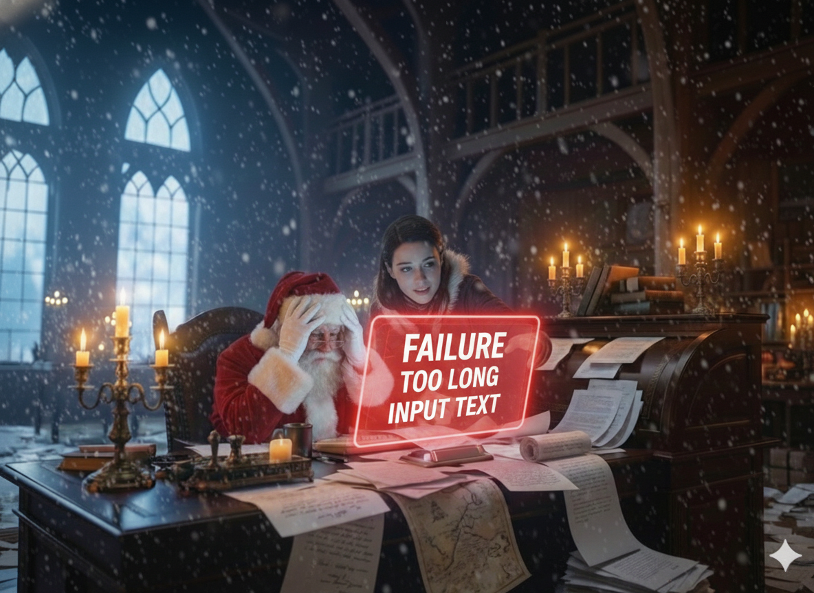

# Day 5: The 10-Page Manifesto

## Story

The morning light filtered through the frosted windows of Santa's office, casting long shadows across the workshop floor. Santa sat at his desk, coffee growing cold beside him, staring at the screen with an expression somewhere between awe and despair.

"This can't be real," he muttered.

The Apprentice looked up from their own workstation. "What's wrong?"

Santa gestured helplessly at the monitor. "This letter. It's... it won't stop. I've been scrolling for five minutes and I'm still not at the end."

The Apprentice wheeled their chair over and leaned in to look. "Who sent it?"

"A girl named Emma. Emma Charlotte Davidson-Rodriguez. From Mississauga." Santa scrolled slowly, his mouse wheel clicking rhythmically. "She's telling me about her entire year. In detail. *Excruciating* detail. She just spent three paragraphs explaining her family's two Thanksgivings."

The Apprentice couldn't help but smile. "She sounds thorough."

"She sounds like she's writing a novel," Santa said, though there was affection in his voice despite the exhaustion. "Look at this—she's apologizing for going off on tangents. While going off on another tangent. She's got seven postscripts. *Seven*."

They sat in silence for a moment, both watching the letter unfold on the screen like an endless scroll from ancient times.

"How long is it?" the Apprentice asked.

Santa checked the document properties. "Ten pages. Single-spaced. Small font. It's over ten thousand words."

"That's longer than most people's college essays."

"That's longer than some novellas I've read," Santa said. He leaned back in his chair, rubbing his temples. "And here's the problem: I can't just... feed this into the model. It's too long. It'll break the context window. The system will choke on it."

The Apprentice was quiet, thinking. Santa had learned to recognize that particular quality of silence—it meant they were solving something.

"What if we don't give it the whole letter at once?" the Apprentice said finally.

Santa looked up. "What do you mean?"

"I mean—what if we chunk it? Break it into sections. Process each section individually, summarize what's important, and then... synthesize. Put all the pieces back together at the end."

"Like reading a book one chapter at a time."

"Exactly. We read chapter one, take notes on what matters. Read chapter two, add to our notes. By the end, we have all the important information without ever having to hold the whole book in our mind at once."

Santa considered this, hope beginning to kindle in his chest. "Map-reduce."

"What?"

"It's a programming pattern," Santa explained, surprising himself with the technical knowledge he'd been accumulating. "You *map* a function across parts of a large dataset, processing each part individually. Then you *reduce* all those results into a single, coherent output."

The Apprentice grinned. "Look at you, becoming a proper cloud architect."

"I've had a good teacher." Santa turned back to the screen, looking at Emma's letter with new eyes. "So we split this into manageable chunks—maybe by topic, or just by length. We ask the model to summarize each chunk: what does Emma want? What's important here? Then we take all those summaries and ask the model to synthesize them into a final wishlist."

"The individual pieces are small enough for the context window," the Apprentice said, "but we still capture everything important from the full letter."

"Will it work?"

"Only one way to find out."

They spent the next hour building the system. The Apprentice wrote code to split the letter into chunks—not arbitrarily, but intelligently, trying to keep related paragraphs together. Each chunk went to the model with a simple instruction: *Read this section of a child's letter. Extract any gifts mentioned and any important context about the child's behavior or circumstances.*

The model processed chunk after chunk, returning concise summaries. Books she wanted. Art supplies. Her brother Max's dinosaur obsession. Her apology for the broken mug in February. The D on her spelling test and her subsequent improvement. Each piece of information, carefully extracted and preserved.

Finally, all the chunk summaries were gathered together and fed to the model one last time: *Here are summaries from different sections of a child's Christmas letter. Synthesize these into a coherent wishlist and behavioral assessment.*

And just like that, ten pages became one. Clarity from chaos. Signal from noise.

Santa read the final output and felt something warm settle in his chest. Emma wanted books, art supplies, a journal, maybe a ukulele. She'd had some minor missteps—the mug, the borrowed pen, the talking in class—but she was trying. Growing. Learning. She was, in every way that mattered, a good kid who sometimes made mistakes and always tried to do better.

"It worked," Santa said quietly.

"It worked," the Apprentice confirmed.

Santa looked at the original ten-page letter, then at the clean, organized summary. "You know what's remarkable? We didn't lose anything that mattered. Emma's personality is still there. Her wishes. Her story. We just... distilled it. Made it manageable."

"Sometimes," the Apprentice said, "the magic isn't in reading everything at once. It's in knowing which pieces to keep and which to set aside. It's in understanding that you can process things step by step and still see the whole picture at the end."

Santa nodded slowly. "How many more letters like this do you think are out there?"

"Probably hundreds. Kids who have a lot to say and no one's really listening."

"Then we build this into the pipeline," Santa decided. "Every long letter gets chunked, processed, synthesized. No child's story is too long to be heard. Not on my watch."

The Apprentice smiled. "You're really getting the hang of this whole GenAI architecture thing."

"I'm getting the hang of a lot of things," Santa said, looking out at the silent workshop that was slowly coming back to life, piece by piece, chunk by chunk, one solved problem at a time. "Tell Emma's story made me realize something: sometimes the longest letters come from the kids who just want to be understood. And if we're going to save Christmas—if we're going to do this right—we need to understand them all."

He turned back to his screen, where thousands more letters waited.

"Next," he said, and meant it.

---



---

## Learning Goal

**Text Chunking and Map-Reduce Summarization**

Today you'll learn how to handle documents that exceed a foundation model's context window limit. This is a critical real-world skill: not all input data will fit neatly into the constraints of your tools. *Chunking* is the strategy of breaking large documents into smaller, manageable pieces. *Map-reduce* is a pattern where you apply a function to each piece independently (map), then combine all the results into a single output (reduce). In GenAI applications, this means processing sections of a long document individually, extracting key information from each section, and then synthesizing those extractions into a coherent final result. This approach preserves important details while staying within technical limitations. In Project Sleigh-Ride, this skill lets Santa process even the longest, most detailed letters without losing any child's story—ensuring that every voice is heard, no matter how verbose.

---

## Participant Challenge

Today, you'll practice chunking and map-reduce summarization using the materials provided for this day. You'll take an extremely long letter (over 10,000 tokens—far exceeding typical context windows) and implement a strategy to process it in sections. Your system should split the letter into chunks, extract key information from each chunk (wishes, behavioral notes, important context), and then synthesize all the extracted information into a clean, organized final wishlist. The goal is to demonstrate that with thoughtful chunking and synthesis, you can process documents of any length while preserving all the important details.

---

## Cost-Saving Tips

1. **Chunk strategically**: Don't split text arbitrarily at exact character counts. Break at natural boundaries (paragraphs, sections, topics) to preserve context and improve extraction quality. This reduces the need for expensive re-processing due to lost context.

2. **Use lighter models for chunking**: The chunk extraction task ("what gifts are mentioned in this section?") is simpler than synthesis and can often use a smaller, cheaper model. Reserve your most powerful model for the final synthesis step.

3. **Set minimum chunk sizes**: Very small chunks (1-2 sentences) create overhead without benefit. Aim for chunks of at least 500-1000 tokens to maximize efficiency while staying within context limits.

---

## Tomorrow's Teaser

Tomorrow, Santa faces a new kind of challenge: a letter that's not too long, but too *vague*. "Something red that goes fast"—what does that even mean? The answer lies in the mathematics of meaning.

---

## Technical Specifications

### Input Files

- **long_letter.txt**: An extremely long letter from a 10-year-old named Emma. The letter contains detailed narratives about her entire year, her family, her hobbies, and eventually, buried within the text, her actual Christmas wishlist. The file exceeds 10,000 tokens and simulates a scanned 10-page PDF document.

**Preview of long_letter.txt:**
```
Dear Santa Claus,

Hi! Hello! Greetings! Salutations! It's me, Emma Charlotte Davidson-Rodriguez 
(yes, that's my full name, hyphenated because my parents couldn't decide, long story), 
writing to you from 2847 Maple Grove Crescent, Unit 12B, Mississauga, Ontario, L5M 7K3, Canada.

I hope this letter finds you well and that you're staying warm up there at the North Pole. 
I imagine it must be very cold. Do you have central heating? Or do you just use fireplaces? 
I've always wondered about that. Also, do the elves get cold? Do they wear special thermal 
underwear? My mom makes me wear thermal underwear in the winter and I hate it because it's 
itchy, but she says it's important to stay warm. Anyway, I'm getting off track already, 
which my teacher Mrs. Patterson says I do a lot...

[Letter continues for 10+ pages with detailed stories about school, family, hobbies, 
and eventually a comprehensive wishlist including books, art supplies, instruments, 
and gifts for her brother Max]
```

The letter contains:
- Extensive background about Emma's year (month by month)
- Details about her family, friends, school, and hobbies
- A lengthy wishlist with multiple categories
- Behavioral self-assessment (mistakes made and lessons learned)
- Information about her brother Max's wishes
- Multiple postscripts and tangential thoughts

### Expected Output

- **final_wishlist_summary.txt**: A synthesized summary document that distills the 10-page letter into a clean, organized wishlist with behavioral assessment.

### Output Format Example

```markdown
# Letter Summary: Emma Charlotte Davidson-Rodriguez

**Child's Name:** Emma Charlotte Davidson-Rodriguez  
**Age:** 10 (turning 11 on January 15th)  
**Location:** Mississauga, Ontario, Canada  
**Grade:** Grade 5

---

## Wishlist

### Books
- The Hobbit by J.R.R. Tolkien
- The Girl Who Drank the Moon by Kelly Barnhill
- Percy Jackson books (books 3+)
- The Mysterious Benedict Society series
- Graphic novels: Amulet, Smile, Sisters

### Art Supplies
- Quality sketchbook
- Colored pencils
- Markers
- Drawing instruction book

### Music & Instruments
- Ukulele OR small keyboard
- Beginner instruction book

### Other Items
- Journal with lock
- Science kit (crystal growing, microscope, or astronomy)
- String lights and room decorations
- Board games (Ticket to Ride, Catan)
- Reading accessories
- Gift cards

### Brother Max (Age 7)
- Dinosaur items
- Lego sets
- Hot Wheels cars

---

## Behavioral Assessment

### Positive Behaviors
- Academic improvement (D to B+ in math)
- Helpful with chores and brother
- Active in school activities
- Responsible pet care

### Minor Issues
- Forgot to feed goldfish (resolved)
- Broke mother's mug accidentally
- Excessive talking in class (improving)

**Recommendation:** Nice List
```

### Validation Criteria

- Output file is valid markdown with clear section headers
- Summary includes child's name, age, location, and grade
- All major wishlist categories are captured and organized
- Behavioral assessment includes positive behaviors and mistakes
- Brother Max's wishes are included
- Summary is significantly shorter than original (approximately 90% reduction)
- No important information from the original letter is lost

### Getting Started

1. **Review the long letter**: Read through `input/long_letter.txt` to understand its structure and length.

2. **Design your chunking strategy**: Decide how to split the letter (by paragraph count, character count, or topic boundaries).

3. **Create the extraction prompt**: Design a prompt that extracts gifts, behavioral notes, and context from each chunk.

4. **Process chunks individually**: Loop through each chunk and collect summaries.

5. **Create the synthesis prompt**: Design a final prompt that combines all chunk summaries into an organized wishlist.

6. **Generate the final output**: Save the synthesized result to `output/final_wishlist_summary.txt`.

**Recommended Approach:**
- Write a Python script that reads the letter, splits it into chunks, processes each chunk, and synthesizes the results
- Test with 2-3 chunks first to verify your prompts work correctly
- Scale up to process the entire letter
- Validate that no important information was lost

### Prerequisites

- Completion of Day 2 (understanding of entity extraction and JSON processing)
- Access to Amazon Bedrock with a foundation model enabled
- Basic Python skills for string manipulation and file I/O
- Understanding of loops and data structures (lists, strings)
- Familiarity with token counting (approximate: 1 token ≈ 4 characters)

### Concepts Covered

- Text chunking strategies for large documents
- Context window management and limitations
- Map-reduce pattern in GenAI workflows
- Multi-step processing pipelines
- Information preservation during summarization
- Prompt engineering for extraction vs. synthesis tasks
- Handling edge cases in document splitting
- Token counting and estimation
- Scalability patterns for document processing

