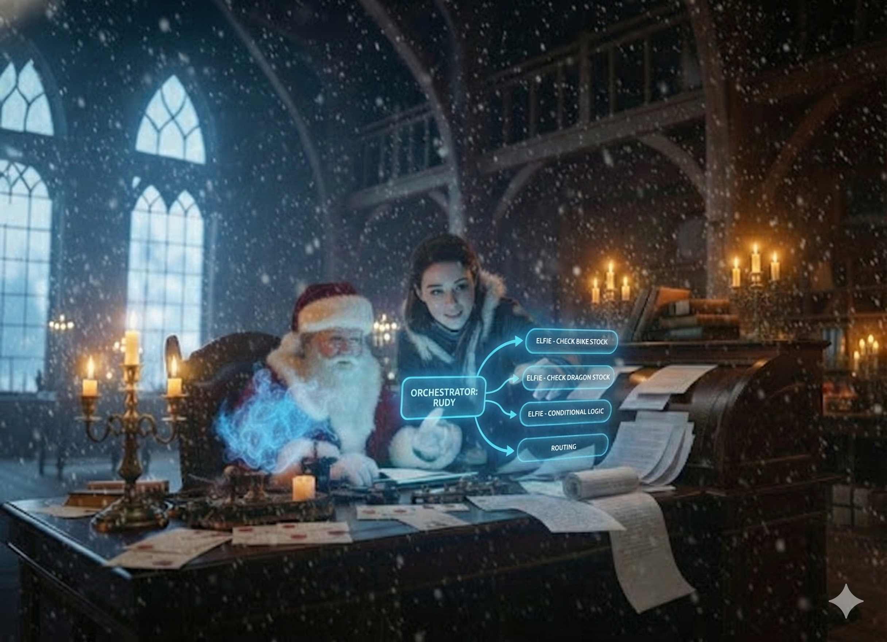

# Day 15: Agent Collaboration

## Story

Rudy was hyperventilating again. "Timmy wants a Red Racing Bike AND a Plush Dragon! And he has a backup wish! It's too complex! I can't check the inventory for all of that while simultaneously planning the route!"

"Delegate," Santa said.

"Delegate?"

"You are the Orchestrator," Santa reminded him. "You don't move the boxes. You tell Elfie to move the boxes."

Rudy paused. "So... I read the letter. I break it down into a list of items. And I hand each item to Elfie?"

"Exactly. You are the brain. She is the hands."

Rudy turned to the digital interface. "Elfie! I have a complex order. Stand by for sub-tasks."

Elfie's cursor blinked. "Ready for input. I love input."

Rudy processed the letter.
1.  *Check stock for Red Racing Bike.* -> "Elfie, check bike."
2.  *Check stock for Plush Dragon.* -> "Elfie, check dragon."
3.  *If stock is low, check Super Console.* -> "Elfie, standby for conditional logic."

"It's a symphony," Rudy whispered. "A symphony of logistics."



---

## Learning Goal

**Multi-Agent Patterns and Routing**

Single agents are powerful, but **Multi-Agent Systems** allow for specialization. One agent (the Planner/Orchestrator) breaks down a complex goal into steps, and other agents (Specialists) execute those steps. This separation of concerns reduces hallucination (because the specialist only sees a small, clear task) and allows for parallel processing. Today you will implement a simple **Handoff** or **Router** pattern.

---

## Participant Challenge

Your challenge is to orchestrate the collaboration between Rudy and Elfie. You will process a complex wish (`complex_wish.txt`) that contains multiple items and logic. You must write a script where:
1.  **Rudy** reads the wish and outputs a list of specific inventory check tasks.
2.  **Elfie** receives each task and generates the appropriate tool call.
3.  The system logs the interaction between the two agents.

---

## Cost-Saving Tips

1.  **Use different models**: Rudy (the Planner) needs a smart model (Claude 3 Sonnet). Elfie (the Tool User) might be fine with a faster, cheaper model (Haiku) since her task is narrower.

2.  **Clear Handoffs**: When Rudy passes a task to Elfie, pass *only* the necessary context (e.g., "Check stock for Red Racing Bike"), not the entire original letter. This saves tokens and keeps Elfie focused.

3.  **Stop Sequences**: Ensure Rudy stops generating after listing the tasks, so he doesn't try to hallucinate Elfie's response too.

4.  **JSON Output**: Ask Rudy to output the plan as a JSON list. This makes it easy for your code to iterate through the items and call Elfie programmatically.

---

## Tomorrow's Teaser

Elfie knows *how* to call the tool, but right now she's just shouting into the void. We need to connect her to the actual warehouse system.

---

## Technical Specifications

### Input Files

*   **complex_wish.txt**: A text file with a multi-part request.

**Preview of complex_wish.txt:**
```text
I would like a Red Racing Bike... and a Plush Dragon...
```

### Expected Output

*   **collaboration_log.txt**: A transcript of the workflow.

**Format Example:**
```text
Rudy: Analyzing wish... Identified 2 items.
Rudy: Task 1 -> Check Red Racing Bike.
Elfie: Tool Call -> get_inventory("Red Racing Bike")
Rudy: Task 2 -> Check Plush Dragon.
Elfie: Tool Call -> get_inventory("Plush Dragon")
```

### Validation Criteria

*   Rudy correctly identifies all items in the wish.
*   Rudy passes clear, single-item tasks to Elfie.
*   Elfie generates a valid tool call for each task.
*   The log shows the back-and-forth interaction.

### Getting Started

1.  **Prompt Rudy**: "You are the Orchestrator. Read this wish and output a JSON list of items to check inventory for."
2.  **Parse Output**: Read Rudy's JSON response in your Python script.
3.  **Loop**: For each item in the list:
    *   **Prompt Elfie**: "You are the Inventory Specialist. Check stock for {item}."
    *   **Capture**: Record Elfie's tool call.
4.  **Log**: Print the results to the file.

### Prerequisites

*   Completion of Days 13 & 14.
*   Basic Python control flow (loops).

### Concepts Covered

*   Multi-Agent Systems
*   Orchestrator/Specialist Pattern
*   Agent Handoff and Routing
*   Task Decomposition
*   JSON-Based Inter-Agent Communication
