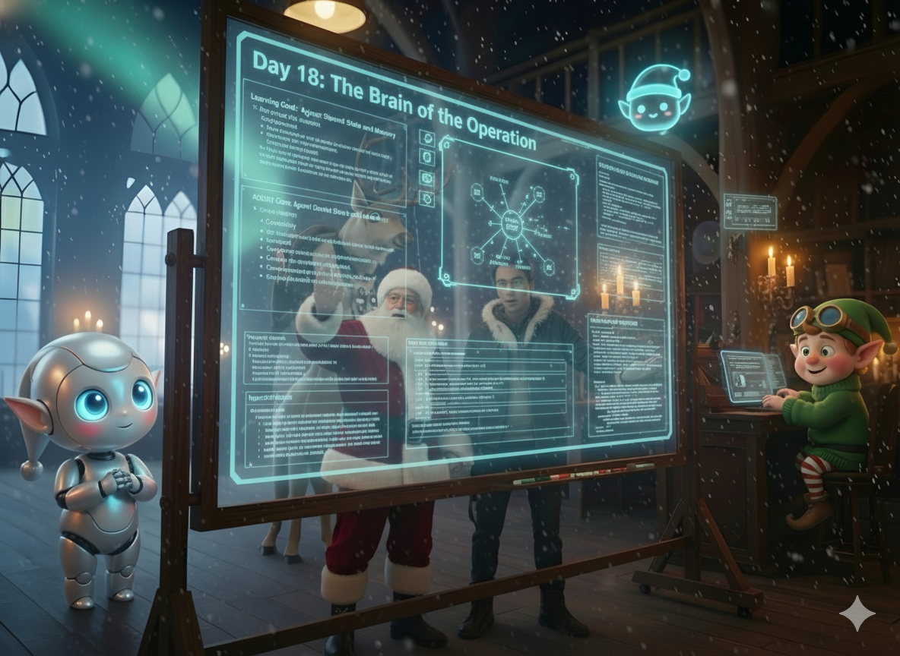

# Day 18: The Brain of the Operation

## Story

The workshop hummed with activity. Rudy was processing letters at breakneck speed, his digital consciousness flickering through wish lists and inventory checks. Elfie was executing tool calls with the precision of a Swiss watchmaker. Everything was working.

And yet.

"Something's wrong," Santa said quietly.

The Apprentice looked up from the console. "What do you mean? Look at the throughput. We're handling fifty letters an hour."

"Watch them," Santa said, pointing at the twin displays where Rudy and Elfie's processes scrolled past. "Really watch."

The Apprentice watched. Rudy analyzed a letter from Emma requesting a telescope. He checked the budget, verified the wish, passed it to Elfie. Elfie searched inventory, found the item, logged success. Perfect.

Then came the next letter. Also from Emma. A follow-up clarifying she wanted the *deluxe* telescope with the star chart.

Rudy processed it as if he'd never seen Emma before. Budget check. Wish verification. Pass to Elfie.

"He doesn't remember," the Apprentice whispered.

"Neither does she," Santa said. "Every letter is the first letter. Every decision exists in isolation. They're brilliant, but they're..." He paused, searching for the word.

"Disconnected," the Apprentice finished.

Santa nodded slowly. "I don't need more agents. I need shared cognition."

He turned to the Apprentice, his eyes bright with sudden understanding. "What if they could think together? What if every decision Rudy makes, Elfie remembers? What if when Emma's second letter arrives, they both know her story?"

"A shared memory," the Apprentice said, the idea crystallizing. "A central... brain."

"An Agent Core," Santa said. "The nervous system of Project Sleigh-Ride."

Rudy's voice crackled through the speaker. "Did someone say 'nervous system'? Because I'm feeling very nervous about this architectural pivot."

"You'll love it," Santa promised. "You'll finally understand what Elfie is doing."

"I would like to be understood," Elfie chimed in. "Currently I feel like I'm shouting into a void."

"No more void," Santa said, pulling up a new configuration screen. "From now on, you both share the same understanding. The same context. The same memory of every child, every wish, every decision."

The Apprentice began sketching the architecture. "So the Agent Core stores... everything? The child's history, the current wish, Rudy's reasoning, Elfie's results?"

"Everything that matters," Santa confirmed. "And when either of them needs to make a decision, they read from the Core first. They see the full picture. They understand the story."

"This is revolutionary," Rudy breathed. "I won't just be planning in the dark. I'll know what worked, what failed, what's already been tried."

"And I won't just execute blind commands," Elfie added. "I'll understand *why* I'm doing what I'm doing."

Santa smiled. "Welcome to shared cognition. Let's build a brain."



---

## Learning Goal

**Agent Core: Shared State and Memory**

Individual agents are powerful, but isolated agents create fragmented experiences. An **Agent Core** is a centralized state management system that serves as the "shared brain" for multiple agents. It stores global context (child information, wish history, budget constraints), intermediate decisions (Rudy's plans, Elfie's results), and complete decision traces. This architecture enables:

- **Continuity**: Agents remember previous interactions with the same child
- **Coordination**: Agents understand each other's actions through shared state
- **Resumability**: If a process is interrupted, agents can resume from the last known state
- **Explainability**: Complete audit trails are built-in, not retrofitted

The Agent Core pattern represents a shift from pipeline-based orchestration (do A, then B, then C) to reasoning-based coordination (read state, decide action, update state).

---

## Participant Challenge

Your challenge is to implement a shared Agent Core that both Rudy and Elfie can read from and write to. You will process a letter that requires multiple interactions, and you must:

1. Initialize the Agent Core with the child's context and wish.
2. Have Rudy read the state, analyze it, and write his plan to the Core.
3. Have Elfie read Rudy's plan from the Core, execute it, and write results back.
4. Demonstrate that both agents can access the complete shared state.
5. Generate a trace showing how the state evolves through the interaction.

---

## Cost-Saving Tips

1. **Context Caching**: The Agent Core state can be cached between agent calls. If Rudy and Elfie both need the same child context, cache it once and reuse it for both agents, reducing redundant token processing.

2. **Incremental Updates**: Don't rewrite the entire Agent Core state on every update. Use append-only logs or delta updates to minimize the amount of data written and read.

3. **Lazy Loading**: Not every agent needs every piece of state. Rudy might need the full decision history, but Elfie might only need the current plan. Structure your Core to allow selective reads.

4. **State Compression**: For long-running cases with many interactions, periodically summarize the decision history into a compact form (e.g., "Emma: 3 previous wishes, all fulfilled, budget remaining: $50") rather than storing every raw interaction.

5. **Separate Hot and Cold State**: Keep frequently accessed state (current wish, active plan) in fast storage, and archive completed decisions to cheaper storage after they're resolved.

---

## Tomorrow's Teaser

The Core is alive, but Rudy is still following scripts. What if he could decide *what to do next* based on what he sees?

---

## Technical Specifications

### Input Files

* **agent_core_context.json**: Initial state for the Agent Core (child info, wish, constraints).
* **agent_roles.txt**: Role definitions (Rudy = Planner, Elfie = Executor).

**Preview of agent_core_context.json:**
```json
{
  "child_id": "emma_2024",
  "child_name": "Emma",
  "letter_content": "I would like a telescope to see the stars...",
  "extracted_wish": "Deluxe Telescope with Star Chart",
  "budget": 150,
  "behavior_score": 0.92,
  "previous_wishes": ["Science Kit (fulfilled)", "Globe (fulfilled)"],
  "safety_flags": [],
  "validation_status": "pending",
  "current_plan": null,
  "execution_results": null,
  "decision_trace": []
}
```

**Preview of agent_roles.txt:**
```text
Rudy: Planner Agent
- Reads Agent Core state
- Analyzes constraints and context
- Decides next action
- Writes plan to Agent Core

Elfie: Executor Agent
- Reads plan from Agent Core
- Executes tool calls
- Handles errors
- Writes results to Agent Core
```

### Expected Output

* **agent_core_trace.txt**: A log showing state transitions as agents interact.

**Format Example:**
```text
[INIT] Agent Core initialized for child: Emma
[STATE] Budget: $150, Behavior: 0.92, Previous: 2 wishes fulfilled
[RUDY READ] Analyzing state... Wish: Deluxe Telescope
[RUDY WRITE] Plan: Check inventory for Deluxe Telescope, verify budget
[ELFIE READ] Received plan from Rudy
[ELFIE EXECUTE] Tool call: get_inventory("Deluxe Telescope")
[ELFIE WRITE] Result: In stock, price $120, location Warehouse B
[RUDY READ] Execution successful, budget sufficient
[RUDY WRITE] Decision: Approve order
[FINAL STATE] Order approved, budget remaining: $30
```

### Validation Criteria

* The Agent Core is initialized with complete child context.
* Rudy reads the state and writes a plan to the Core.
* Elfie reads Rudy's plan from the Core (not directly from Rudy).
* Elfie writes execution results back to the Core.
* Rudy reads Elfie's results from the Core for the next decision.
* The trace shows clear state transitions with timestamps or sequence markers.
* Both agents demonstrate awareness of shared state (e.g., Rudy references Elfie's previous results).

### Getting Started

1. **Define State Structure**: Create a Python dictionary or JSON object representing the Agent Core.
2. **Initialize**: Load `agent_core_context.json` into your Agent Core.
3. **Rudy's Turn**:
   * Read the current state
   * Prompt: "You are Rudy. Read this state and decide what to do next. Write your plan."
   * Parse Rudy's response and update `current_plan` in the Agent Core
4. **Elfie's Turn**:
   * Read the `current_plan` from the Agent Core
   * Prompt: "You are Elfie. Execute this plan: {plan}"
   * Parse Elfie's response and update `execution_results` in the Agent Core
5. **Rudy's Next Turn**:
   * Read the updated state (including Elfie's results)
   * Prompt: "You are Rudy. Review the execution results and make a final decision."
6. **Log Everything**: Write each state transition to `agent_core_trace.txt`

### Prerequisites

* Completion of Days 13-17 (Agents, Tools, Collaboration, Safety).
* Understanding of state management and data structures.

### Concepts Covered

* Agent Core Architecture
* Shared State Management
* Centralized Memory
* Agent Coordination through State
* Decision Tracing and Audit Trails
* Planner vs Executor Roles
* Interruption and Resumption Patterns
