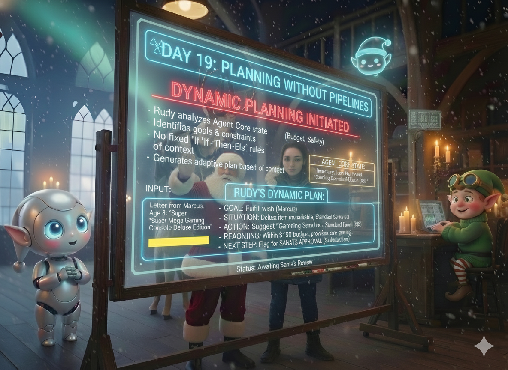

# Day 19: Planning Without Pipelines

## Story

The Agent Core hummed with activity. Rudy and Elfie were coordinating beautifully through shared state, processing letters with mechanical precision.

But Santa noticed something.

"Watch Rudy," he said to the Apprentice, pointing at the console where Rudy's reasoning scrolled past.

The Apprentice watched. Letter after letter, Rudy followed the same pattern:
1. Read letter
2. Check inventory
3. Make decision

Every. Single. Time.

"He's following a script," the Apprentice said slowly.

"Exactly," Santa replied. "He's not thinking. He's executing a pipeline. Letter arrives, step one, step two, step three, done. But what happens when something unexpected occurs?"

As if on cue, a new letter appeared on screen. From Marcus. Age 8. Requesting a "Super Mega Gaming Console Deluxe Edition."

Rudy began his routine. Read letter. Check inventory.

"Item not found," Elfie reported.

Rudy paused. His process hung. The pipeline had no step for "item not found."

"He's stuck," the Apprentice whispered.

Santa leaned forward. "Because I gave him a script, not a brain. He needs to *plan*, not follow steps."

He pulled up Rudy's configuration. "What if, instead of telling Rudy what to do, we tell him what we want to achieve? What if he looks at the Agent Core state and decides for himself what to do next?"

The Apprentice's eyes widened. "Dynamic planning."

"Exactly. No more pipelines. No more 'do A, then B, then C.' Instead: 'Here's the situation. Here's the goal. You decide.'"

Santa began typing. "Rudy, your goal is to fulfill Marcus's wish within budget and safety constraints. The item isn't in inventory. What do you do?"

A moment passed. Then Rudy's response appeared:

"Item not in primary inventory. Checking alternative suppliers. If unavailable, I'll search for similar items within the same category. If that fails, I'll flag for Santa's approval with suggested alternatives."

The Apprentice stared. "He... reasoned through it."

"He planned," Santa corrected. "Based on the current state, he decided the next best action. Not because I told him to, but because he understood the goal."

Rudy continued: "Alternative found: Gaming Console Standard Edition, $95, in stock. Within budget. Shall I proceed or escalate?"

"That's not in any script," the Apprentice breathed.

"No," Santa smiled. "That's intelligence. That's what happens when you stop building pipelines and start building systems that think."

He turned to the Apprentice. "Today, we teach Rudy to plan. Not to follow. To reason. To adapt. To decide what comes next based on what he sees, not what we programmed."

"No more state machines?" the Apprentice asked.

"No more state machines," Santa confirmed. "Just goals, context, and reasoning. Welcome to dynamic planning."


---

## Learning Goal

**Dynamic Planning and Goal-Based Reasoning**

Traditional agent systems follow fixed pipelines: do step A, then step B, then step C. This works for predictable scenarios but breaks when the unexpected happens. **Dynamic Planning** means the agent examines the current state, understands the goal, and decides the next action based on reasoning rather than following a script.

In this architecture:
- **No fixed state machines**: Rudy doesn't have a hardcoded "if inventory found, then X, else Y"
- **Goal-oriented**: Rudy knows the objective (fulfill wish, stay in budget, ensure safety)
- **Context-aware**: Rudy reads the Agent Core state to understand the situation
- **Adaptive**: Rudy's plan changes based on what he discovers

This represents a shift from **procedural orchestration** (follow these steps) to **cognitive orchestration** (achieve this goal).

---

## Participant Challenge

Your challenge is to implement dynamic planning where Rudy acts as a reasoning agent. You will:

1. Define high-level goals (not step-by-step instructions)
2. Have Rudy read the Agent Core state
3. Have Rudy reason about the situation and constraints
4. Have Rudy generate a dynamic plan based on current context
5. Demonstrate that the plan adapts to different scenarios

The key difference from Day 18: Rudy doesn't follow a script. He decides what to do based on what he sees.

---

## Cost-Saving Tips

1. **Prompt Caching for Goals**: The high-level goals and constraints rarely change. Cache them in the system prompt so they're not re-processed on every planning request.

2. **Lightweight Planning Models**: For simple decisions (item in stock, budget OK), use a fast model like Haiku. Reserve Sonnet/Opus for complex reasoning scenarios.

3. **Plan Reuse**: If Rudy encounters a similar situation (same child, similar wish), check if a previous plan can be adapted rather than reasoning from scratch.

4. **Incremental Planning**: Don't plan the entire workflow upfront. Plan one step, execute, observe results, then plan the next step. This avoids wasted planning for scenarios that don't occur.

5. **Confidence Thresholds**: If Rudy's confidence in a plan is high (>0.9), execute immediately. If low (<0.7), escalate to Santa. This reduces unnecessary human-in-the-loop overhead.

---

## Tomorrow's Teaser

Rudy can plan dynamically, but he's doing a lot of thinking. What if he could remember what worked before?

---

## Technical Specifications

### Input Files

* **planning_goals.txt**: High-level objectives and constraints for Rudy.

**Preview of planning_goals.txt:**
```text
RUDY'S PLANNING GOALS
=====================

Primary Objective:
Fulfill the child's wish within budget and safety constraints.

Constraints:
- Budget must not be exceeded
- All items must pass safety validation
- High-value items (>$200) require Santa's approval
- Low behavior scores (<0.5) require Santa's review

Available Actions:
- Check inventory for requested item
- Search for alternative items in same category
- Escalate to Santa for approval
- Request additional information from child
- Mark wish as unfulfillable with explanation

Decision Criteria:
- If item found and budget OK: Proceed
- If item not found: Search alternatives
- If no alternatives: Escalate with suggestions
- If safety concern: Block and alert
- If budget exceeded: Suggest lower-cost alternative or escalate
```

### Expected Output

* **rudy_plan.json**: Rudy's dynamic plan based on the scenario.

**Format Example (Simple Scenario):**
```json
{
  "scenario": "simple",
  "child": "Emma",
  "situation_analysis": "Item found in inventory, price within budget, excellent behavior score",
  "goal": "Fulfill wish",
  "plan": {
    "action": "approve_order",
    "item": "Deluxe Telescope",
    "reasoning": "All constraints satisfied, no obstacles detected",
    "requires_approval": false,
    "next_agent": "elfie"
  }
}
```

**Format Example (Complex Scenario):**
```json
{
  "scenario": "complex",
  "child": "Marcus",
  "situation_analysis": "Requested item not in inventory, alternatives available, budget allows standard edition",
  "goal": "Fulfill wish with best available alternative",
  "plan": {
    "action": "suggest_alternative",
    "original_item": "Super Mega Gaming Console Deluxe Edition",
    "suggested_item": "Gaming Console Standard Edition",
    "reasoning": "Deluxe edition unavailable. Standard edition provides core functionality at $95, well within $150 budget. Maintains gaming experience.",
    "requires_approval": true,
    "approval_reason": "Substituting requested item with alternative",
    "next_agent": "santa"
  }
}
```

### Validation Criteria

* Rudy reads the Agent Core state (or scenario context)
* Rudy analyzes the situation (what's the current state?)
* Rudy identifies constraints (budget, safety, behavior)
* Rudy generates a plan that adapts to the specific scenario
* Simple scenario → Direct approval
* Complex scenario → Alternative suggestion with escalation
* Plan includes reasoning, confidence, and next action
* No hardcoded "if-then" logic visible in the output

### Getting Started

1. **Load Goals**: Read `planning_goals.txt` to understand Rudy's objectives
2. **Build Planning Prompt**:
   ```
   You are Rudy, the Planning Agent.
   
   Goals: [insert goals from planning_goals.txt]
   
   Current Situation: [insert scenario data]
   
   Analyze the situation and create a dynamic plan.
   Consider: What's the current state? What obstacles exist?
   What's the best next action to achieve the goal?
   
   Output JSON with: situation_analysis, goal, plan (action, reasoning, confidence, next_agent)
   ```
4. **Invoke Rudy**: Use Bedrock to generate the plan
5. **Parse and Save**: Extract the JSON plan and save to `rudy_plan.json`
6. **Test Both Scenarios**: Show that Rudy adapts his plan based on context

### Prerequisites

* Completion of Day 18 (Agent Core)
* Understanding of goal-based reasoning
* Familiarity with LLM prompting for structured output

### Concepts Covered

* Dynamic Planning
* Goal-Based Reasoning
* Context-Aware Decision Making
* Adaptive Agent Behavior
* Escalation Logic
* No Fixed State Machines
