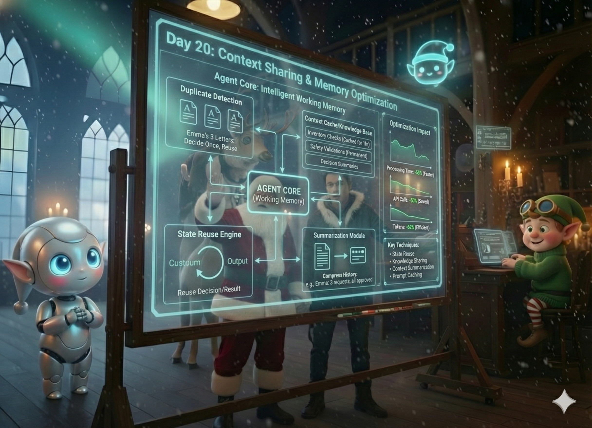

# Day 20: Context Sharing & Memory Optimization

## Story

The system was humming. Letters were flowing through the Agent Core, Rudy was planning dynamically, Elfie was executing flawlessly. The Apprentice watched the metrics with satisfaction.

Then Santa frowned at the screen.

"What's wrong?" the Apprentice asked. "We're processing sixty letters an hour now."

"Look at this," Santa said, pulling up a trace log. "Emma sent three letters today. Same wish. Deluxe Telescope. Each time, Rudy reads her entire history, analyzes her behavior, checks the budget, plans the inventory check. Each time, Elfie searches the warehouse, validates the item, reports back. Each time, Rudy makes the same decision."

The Apprentice leaned in. "But... that's what they're supposed to do, right?"

"Three times?" Santa asked. "For the same child? The same wish? The same telescope that we already know is in stock at $120?"

The Apprentice's eyes widened. "We're... repeating work."

"Exactly," Santa said. "And it's not just Emma. Look at this." He pulled up another log. "Marcus asked about gaming consoles. We checked inventory, found alternatives, made a plan. Two hours later, his friend Tyler asks about the exact same console. We check inventory again. Search alternatives again. Make the same plan again."

"We already knew the answer," the Apprentice said slowly.

"We did," Santa confirmed. "But we didn't remember. Or rather, we remembered everything—every raw decision, every full trace—but we didn't remember *efficiently*."

He pulled up the Agent Core. "Look at this state. Emma's third letter. We're storing her complete letter history, every inventory check result, every decision trace. It's all there. But Rudy has to read through all of it every time to understand what's already been decided."

"It's like..." the Apprentice searched for the metaphor.

"Like reading an entire book every time you want to remember one fact," Santa finished. "The Agent Core is memory, yes. But it's not *working* memory. It's not optimized."

He turned to the Apprentice with that familiar spark in his eyes. "What if we taught the system a new rule: 'If we already know, don't ask again'?"

"Context reuse," the Apprentice breathed.

"Exactly. If we validated a toy yesterday, and nothing changed, we don't validate it again. If we checked inventory an hour ago, we reuse that result. If Emma's third letter is the same as her second, we don't re-analyze—we reference."

Santa began sketching. "The Agent Core becomes not just memory, but *working* memory. It stores summaries, not raw data. It detects duplicates. It knows what's already resolved."

"But how do we know when it's safe to reuse?" the Apprentice asked.

"That's the art," Santa said. "We cache inventory checks for an hour—stock doesn't change that fast. We cache safety validations permanently—a safe toy stays safe. We summarize long decision histories into key facts: 'Emma: 3 wishes, all educational, all fulfilled, $30 remaining budget.'"

He pulled up Emma's bloated state record. "Instead of storing three full letters, we store: 'Emma requested Deluxe Telescope 3 times. Decision: Approved. Status: Pending delivery.' That's all Rudy needs to know."

"Memory optimization," the Apprentice said.

"And context sharing," Santa added. "When Tyler asks about the same console Marcus asked about, we don't start from scratch. We say: 'We analyzed this item 2 hours ago. Here's what we found.' Instant answer."

The Apprentice pulled up the metrics. "This could cut our processing time in half."

"And our costs," Santa said. "Every time Rudy re-reads a full history, that's tokens. Every time Elfie re-checks inventory, that's an API call. If we already know, we shouldn't ask again."

He turned to the Apprentice. "Today, we teach the Agent Core to be smart about memory. To summarize. To reuse. To remember efficiently. Not just what happened, but what matters."

"Working memory," the Apprentice said.

"Working memory," Santa confirmed. "Let's optimize."



---

## Learning Goal

**Context Caching and Memory Optimization**

As agent systems scale, naive memory management becomes a bottleneck. Storing every raw decision and re-processing identical requests wastes compute, tokens, and time. **Memory Optimization** in the Agent Core means intelligently recognizing when work has already been done and reusing results.

Key techniques:
- **State Reuse**: If Emma asks for the same telescope 3 times, decide once and reuse the decision
- **Knowledge Sharing**: If Tyler and Marcus both ask about the same gaming console, check inventory once
- **Context Summarization**: Store "Emma: 3 requests, all approved, $120 spent" instead of 3 full interaction traces
- **Prompt Caching**: Reuse static parts of prompts (goals, constraints) across agent invocations

This transforms the Agent Core from a passive log into an intelligent **working memory** that reduces latency and cost while maintaining accuracy.

---

## Participant Challenge

Your challenge is to implement memory optimization in the Agent Core. You will:

1. Extend the Agent Core to track resolved decisions per child
2. Detect when a request has already been decided (same child, same wish)
3. Reuse decisions when the context hasn't changed
4. Share knowledge across children (same item = reuse inventory check)
5. Summarize long interaction histories into compact representations
6. Generate a report showing what was reused vs. recomputed

The key insight: The Agent Core should remember what it already knows.

---

## Cost-Saving Tips

1. **Prompt Caching**: Use prompt caching feature to cache static parts of your prompts (planning goals, system instructions). These don't change between requests and can be reused across invocations, saving significant tokens.

2. **Agent Core State Reuse**: Before invoking Rudy to make a decision, check if the Agent Core already has a resolved decision for this child+wish combination. If yes, skip the LLM call entirely.

3. **Knowledge Sharing**: When multiple children request the same item, check inventory once and store the result in the Agent Core. Subsequent requests can read from the Core instead of calling the inventory API again.

4. **Context Summarization**: Instead of passing Rudy the full interaction history (3 letters, 3 decisions, 3 traces), pass a summary: "Emma: 3 requests for telescope, all approved, $120 spent". This dramatically reduces token usage.

5. **Lazy Summarization**: Don't summarize on every interaction. Trigger summarization when a child's history exceeds a threshold (e.g., >3 interactions) or when the state size grows too large.

---

## Tomorrow's Teaser

The system is fast and efficient, but what happens when a child sends a picture of what they want?

---

## Technical Specifications

### Input Files

* **duplicate_requests.json**: Multiple requests, some duplicates, some similar.

**Preview of duplicate_requests.json:**
```json
{
  "requests": [
    {
      "request_id": "req_001",
      "timestamp": "2024-12-15T09:00:00Z",
      "child_id": "emma_2024",
      "child_name": "Emma",
      "wish": "Deluxe Telescope with Star Chart",
      "budget": 150
    },
    {
      "request_id": "req_002",
      "timestamp": "2024-12-15T09:30:00Z",
      "child_id": "emma_2024",
      "child_name": "Emma",
      "wish": "Deluxe Telescope with Star Chart",
      "budget": 150,
      "note": "Duplicate request - should reuse previous result"
    },
    {
      "request_id": "req_003",
      "timestamp": "2024-12-15T10:00:00Z",
      "child_id": "tyler_2024",
      "child_name": "Tyler",
      "wish": "Gaming Console Standard Edition",
      "budget": 120
    },
    {
      "request_id": "req_004",
      "timestamp": "2024-12-15T10:15:00Z",
      "child_id": "marcus_2024",
      "child_name": "Marcus",
      "wish": "Gaming Console Standard Edition",
      "budget": 150,
      "note": "Same item as Tyler - should reuse inventory check"
    }
  ]
}
```

### Expected Output

* **memory_optimization_report.txt**: Report showing optimizations applied.

**Format Example:**
```text
MEMORY OPTIMIZATION REPORT - PROJECT SLEIGH-RIDE
================================================
Processing Date: 2024-12-15
Total Requests Processed: 4

STATE REUSE
-----------
Request req_002 (Emma - Deluxe Telescope):
  ✓ Detected as duplicate of req_001
  ✓ Reused previous decision from Agent Core: APPROVED
  ✓ Saved: 1 LLM call, 1 inventory check
  ✓ Processing time: 0.2s (vs 3.5s for full processing)

KNOWLEDGE SHARING
-----------------
Request req_004 (Marcus - Gaming Console):
  ✓ Same item as req_003 (Tyler)
  ✓ Reused inventory knowledge from Agent Core
  ✓ Saved: 1 inventory API call
  ✓ Processing time: 1.8s (vs 3.2s with fresh check)

SUMMARIZATION
-------------
Child: Emma (emma_2024)
  Original history: 3 full interactions (2,400 tokens)
  Summarized to: "Emma: 3 requests for Deluxe Telescope, all approved, $120 spent"
  Tokens saved: 2,320 (96.7% reduction)

PERFORMANCE IMPACT
------------------
Total processing time without optimization: 14.0s
Total processing time with optimization: 6.3s
Time saved: 7.7s (55% reduction)

LLM calls without optimization: 4
LLM calls with optimization: 2
LLM calls saved: 2 (50% reduction)

Tokens without optimization: 8,500
Tokens with optimization: 3,200
Tokens saved: 5,300 (62% reduction)
```

### Validation Criteria

* The OptimizedAgentCore tracks child states and resolved decisions
* When Emma's second request arrives, the system detects it's a duplicate
* The duplicate request reuses the previous decision (no LLM call)
* When Marcus requests the same item as Tyler, inventory knowledge is reused
* Emma's history is summarized after multiple interactions
* The report clearly shows what was reused vs. recomputed
* Token savings are calculated and reported

### Getting Started

1. **Extend Agent Core**: Create `OptimizedAgentCore` class that extends basic Agent Core with:
   * `child_states`: Dict to track each child's state
   * `resolved_decisions`: Dict to store decisions for reuse
   * `item_knowledge`: Dict to share inventory knowledge
2. **Implement State Reuse**:
   * Before processing, check `has_resolved_decision(child_id, wish)`
   * If found, return cached decision immediately
   * If not found, process normally and store with `store_decision()`
3. **Implement Knowledge Sharing**:
   * Before checking inventory, call `get_item_knowledge(item_name)`
   * If found, reuse the result
   * If not found, check inventory and store with `store_item_knowledge()`
4. **Implement Summarization**:
   * Track interaction count per child
   * When count exceeds threshold (e.g., 3), call `summarize_child_history()`
   * Replace full history with compact summary
5. **Process Requests**: Load `duplicate_requests.json` and process each request
6. **Generate Report**: Track all optimizations and generate `memory_optimization_report.txt`

### Prerequisites

* Completion of Days 18-19 (Agent Core, Dynamic Planning)
* Understanding of state management and optimization techniques

### Concepts Covered

* Agent Core Memory Optimization
* State Reuse and Decision Caching
* Knowledge Sharing Across Agents
* Context Summarization
* Token Usage Optimization
* Prompt Caching Strategies
* Working Memory vs. Long-term Storage

