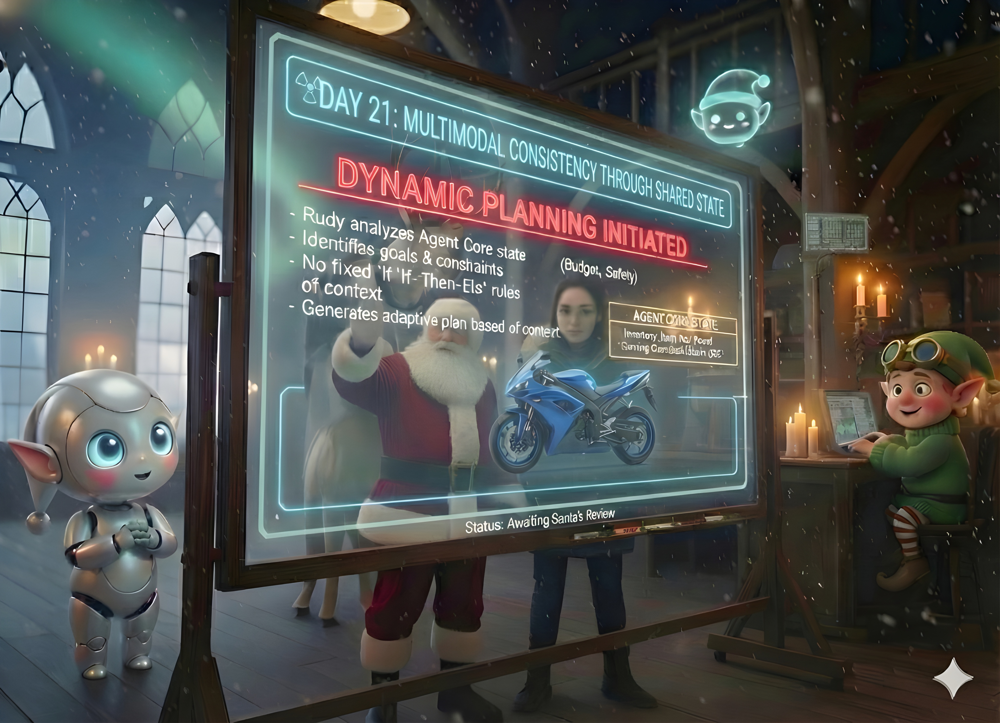

# Day 21: Multimodal Consistency Through Shared State

## Story

Elfie held up the Christmas card. It featured a beautiful, hand-painted illustration of a **Blue** Racing Bike.

Rudy held up the shipping manifest. It listed one **Red** Racing Bike.

"We have a problem," Rudy said.

"What?" Elfie asked. "It's a bike. It races. It's awesome."

"The child asked for a bike like the sky," Rudy said, pointing to the letter. "The Image Generator made it blue. But the Inventory System only had red. You bought the red one because the text description just said 'Racing Bike'."

"I optimized for availability," Elfie defended.

"You optimized for disappointment!" Rudy cried. "The image, the text, and the physical item must match! We need a Single Source of Truth that spans all modalities."

"So... if I pick a red bike," Elfie said slowly, "I need to tell the Image Generator to paint it red?"

"Yes! The State dictates the Reality. Not the other way around."



---

## Learning Goal

**Multimodal Coordination and Shared State**

In a multimodal system (Text + Images + Data), consistency is hard. If one agent generates an image and another orders a product, they can easily drift apart. Today, you will learn to use the **Shared State** (from Day 20) as the anchor. You will ensure that the visual representation (generated image) matches the structured data (inventory attributes).

---

## Participant Challenge

Your challenge is to fix the "Blue Bike/Red Bike" consistency error. You will process a request where the inventory dictates specific attributes (e.g., Color, Material). You must:
1.  Query the inventory to find the *actual* item details (`purchased_toy_meta.json`).
2.  Update the Shared State with these specific visual details.
3.  Dynamically generate an image prompt that explicitly includes these details.
4.  Verify that the "generated" description matches the inventory.

---

## Cost-Saving Tips

1.  **Text-First Generation**: Don't generate the image until *after* you have secured the inventory. Generating an image for an out-of-stock item is a waste of money.

2.  **Prompt Templating**: Use Python f-strings to inject the inventory details into the image prompt. `prompt = f"A festive card showing a {item_color} {item_name}..."`

3.  **Attribute Extraction**: If the inventory data is messy, use a small LLM call to extract just the visual adjectives ("Red", "Shiny", "Metal") before building the prompt.

---

## Tomorrow's Teaser

The system is consistent. But sometimes, the system is just wrong. Sometimes, a child asks for a pony, and the system says "No." That's when we need the Big Guy.

---

## Technical Specifications

### Input Files

*   **purchased_toy_meta.json**: Detailed attributes of the item that was actually bought.

**Preview of purchased_toy_meta.json:**
```json
{
  "product_id": "PROD-020",
  "name": "Bicycle",
  "attributes": {
    "color": "Neon Red",
    "material": "Carbon Fiber",
    "pattern": "Lightning Bolts"
  }
}
```

### Expected Output

*   **consistent_prompt.txt**: The generated image prompt that matches the data.

**Format Example:**
```text
Original Wish: A bike like the sky.
Inventory Reality: Neon Red, Lightning Bolts.
Final Prompt: A Christmas card featuring a Neon Red Racing Bike with Lightning Bolts pattern, parked in snow.
Consistency Check: PASSED.
```

### Validation Criteria

*   The final prompt contains the specific color ("Neon Red") from the inventory.
*   The final prompt ignores the conflicting user description ("like the sky") in favor of the physical reality.
*   The script outputs a "Consistency Check" result.

### Getting Started

1.  **Load Data**: Read the JSON.
2.  **Extract Visuals**: Pull out `color`, `material`, `pattern`.
3.  **Construct Prompt**: Create the string using these variables.
4.  **Compare**: Check if the prompt string contains the inventory values.

### Prerequisites

*   Completion of Day 20.
*   Basic String Manipulation.
