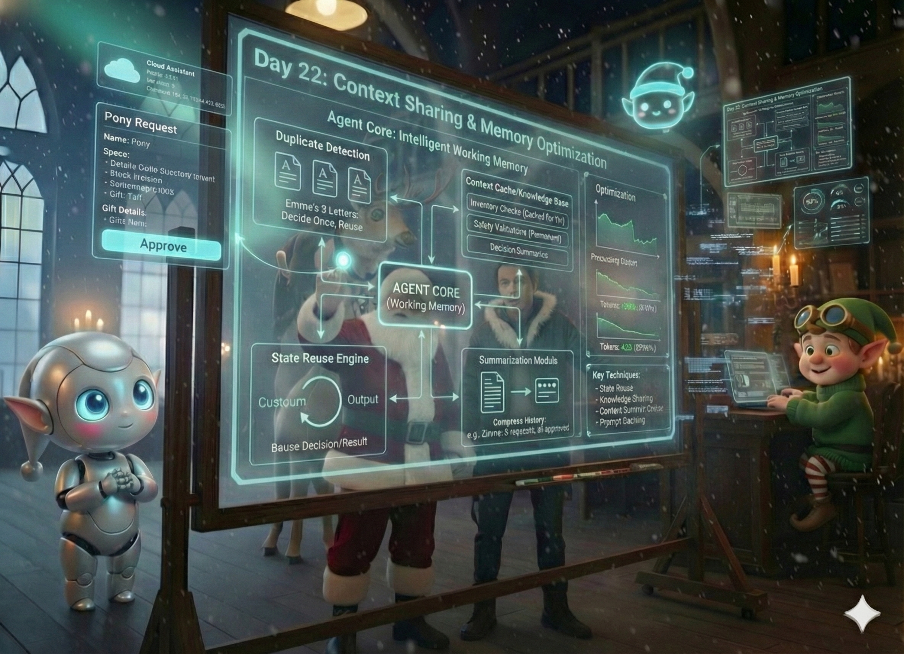

# Day 22: Human-in-the-Loop as a First-Class Agent

## Story

The alert flashed on the big screen. **ESCALATION REQUIRED**.

Rudy was pacing. "I can't decide! The logic is circular! The child wants a pony. Ponies are on the 'Difficult to Ship' list, but they are NOT on the 'Banned' list. The budget allows it, but the stable capacity is unknown. I am stuck in a loop!"

Elfie looked at the button. "Should I just buy a plush pony?"

"No!" Rudy cried. "Accuracy is paramount!"

Santa stepped forward. He didn't look like a user. He looked like... an API endpoint.

"Route it to me," Santa said.

"To... you?"

"I am an agent," Santa said. "I have a latency of 30 seconds. I have a high cost per token. But I have infinite context window and superior reasoning capabilities. Treat me like a tool."

Rudy typed. `call_tool("Santa_Decision", context="Pony Request")`.

Santa's phone buzzed. He tapped 'Approve'.

Rudy relaxed. "Decision received. Proceeding with Pony acquisition."



---

## Learning Goal

**Human-in-the-Loop (HITL) as Agent**

Often, HITL is treated as an "exception" or a failure state. In advanced agentic systems, humans are just another **Tool** or **Agent**. The system routes a task to a human, pauses execution (suspends state), waits for the human to respond (callback), and then resumes. Today, you will implement this "Interrupt/Resume" pattern.

---

## Participant Challenge

Your challenge is to handle the "Pony Request" (`letter_pony.txt`). You will configure Rudy to:
1.  Detect a high-stakes ambiguity (Live Animal Request).
2.  Suspend the automated workflow.
3.  Generate a "Human Task" (a simple text prompt for you).
4.  Wait for your input (Y/N).
5.  Resume the workflow based on your decision.

---

## Cost-Saving Tips

1.  **Async Patterns**: Don't keep the Lambda function running while waiting for the human! That costs money. Save the state to a database (DynamoDB/S3), kill the process, and trigger a new process when the human responds.

2.  **Clear Context**: When asking the human, provide *all* necessary info in one screen. Don't make the human dig through logs. "Child: Timmy. Request: Pony. Budget: OK. Risk: High. Approve?"

3.  **Timeout**: If the human doesn't answer in 24 hours, have a default fallback (e.g., "Auto-Reject" or "Send Plushie").

---

## Tomorrow's Teaser

The decisions are made. The toys are bought. Now Santa needs to know what happened without reading 100,000 log files.

---

## Technical Specifications

### Input Files

*   **letter_pony.txt**: A letter requesting a live pony.

**Preview of letter_pony.txt:**
```text
Dear Santa,
I have been very good. I want a real pony. Not a toy one. A real one that eats carrots.
Love, Jenny
```

### Expected Output

*   **hitl_log.txt**: A log showing the suspension and resumption.

**Format Example:**
```text
Agent: Analyzing Request...
Agent: Detected 'Live Animal'. Confidence: Low.
Action: Suspending Workflow. Requesting Human Review.
---
Human Input Required: Approve 'Real Pony' for Jenny? (Y/N)
> Y
---
Action: Resuming Workflow.
Agent: Human approved. Initiating Livestock Transport Protocol.
```

### Validation Criteria

*   The script pauses execution to accept user input (using Python's `input()` function is fine for simulation).
*   The script branches logic based on the input (Y -> Buy, N -> Reject).
*   The log reflects the "Agent -> Human -> Agent" handoff.

### Getting Started

1.  **Logic Check**: `if "pony" in text: return ask_human()`.
2.  **Input**: `decision = input("Approve? ")`.
3.  **Branch**: `if decision == "Y": buy_pony() else: buy_plushie()`.

### Prerequisites

*   Completion of Day 21.
*   Basic Control Flow.
