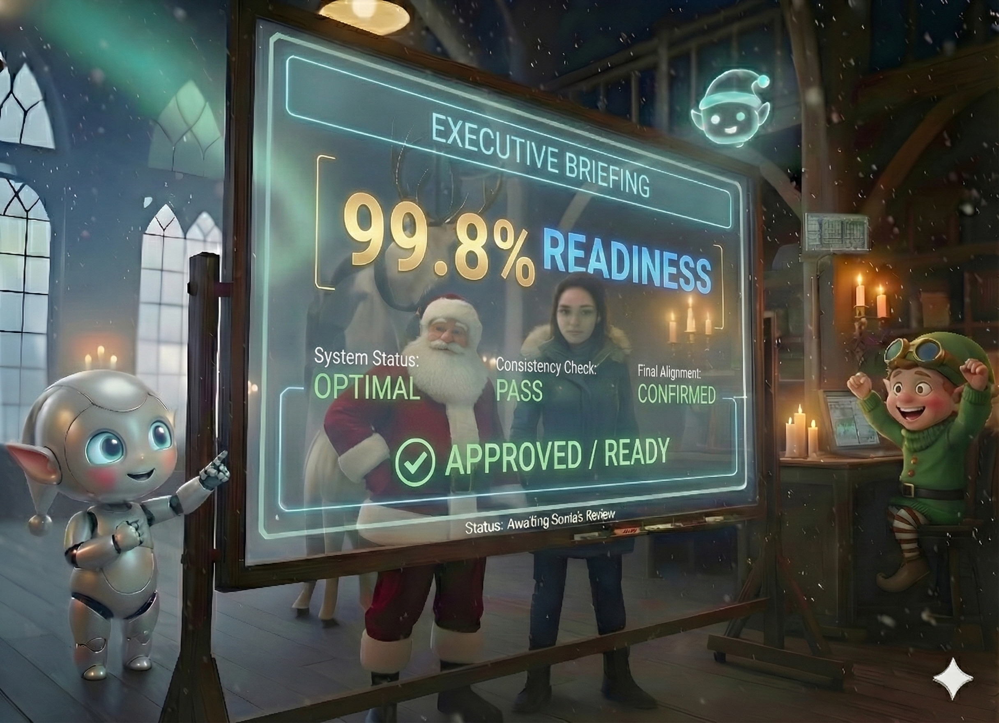

# Day 23: The Agent Executive Briefing

## Story

Santa walked into the control room on the morning of Christmas Eve. The screens were scrolling so fast they were a blur.

"Status," Santa commanded.

He didn't want a list of 50,000 JSON objects. He didn't want a stack trace.

Rudy appeared on the main monitor. He was wearing a digital tie.

"Good morning, Sir. Here is the Executive Briefing."

*   **Overall Status**: 99.8% Ready.
*   **Critical Issues**: 3 (Resolved).
    *   *Issue 1*: Uranium Request (Blocked by Safety).
    *   *Issue 2*: Pony Request (Approved by You).
    *   *Issue 3*: API Outage (Recovered via Backoff).
*   **Trend Analysis**: 40% increase in requests for "Retro Consoles".
*   **Recommendation**: Authorize overtime for the Reindeer Team.

Santa nodded. "Excellent summary, Rudy. How did you know to highlight those specific issues?"

"I analyzed the Agent Core memory," Rudy said. "I looked for 'High Priority' flags and 'Human Interventions'. The rest is just noise."



---

## Learning Goal

**Agent Summarization and Decision-Level Reporting**

Observability isn't just about logs; it's about **Insight**. A mature agentic system can reflect on its own operations and generate high-level summaries for human stakeholders. Today, you will build a "Reporting Agent" that reads the raw logs from the previous days and synthesizes a concise Executive Briefing.

---

## Participant Challenge

Your challenge is to turn raw data (`daily_logs_raw.txt`) into a readable report. You must:
1.  Read the raw logs (containing mix of success, errors, and warnings).
2.  Filter for "Significant Events" (Errors, Blocks, HITL).
3.  Use an LLM to generate a natural language summary.
4.  Output the final "Executive Briefing".

---

## Cost-Saving Tips

1.  **Filter First**: Don't feed 10MB of logs to the LLM. Use Python to grep for "Error", "Warning", or "Critical" lines first. Only send those 50 lines to the LLM for summarization.

2.  **Structured Output**: Ask the LLM to output Markdown or HTML directly. "Format as a bulleted list with bold headers."

3.  **Sampling**: If you have 1 million logs, sample 1% to get a "vibe check" of the trends, rather than processing everything.

---

## Tomorrow's Teaser

The briefing is done. The sleigh is packed. But one parent is unhappy. They want to know *why* their child got coal. It's time to open the black box.

---

## Technical Specifications

### Input Files

*   **daily_logs_raw.txt**: A simulated log file with thousands of entries.

**Preview of daily_logs_raw.txt:**
```text
[INFO] Order #101 processed.
[INFO] Order #102 processed.
[WARN] Order #103 blocked by Safety Filter (Uranium).
[INFO] Order #104 processed.
[ERROR] API Timeout on Order #105. Retrying...
[INFO] Order #105 success.
```

### Expected Output

*   **executive_briefing.md**: A markdown summary.

**Format Example:**
```markdown
# Daily Operations Report

## Highlights
- **Safety**: Successfully blocked 1 attempt to purchase hazardous materials.
- **Resilience**: Recovered from 1 API timeout event.

## Statistics
- Total Orders: 5
- Success Rate: 100% (eventually)
```

### Validation Criteria

*   The report accurately reflects the "WARN" and "ERROR" events from the log.
*   The report calculates basic stats (Total Orders) correctly.
*   The output is valid Markdown.

### Getting Started

1.  **Parse**: Read file line by line. Count "INFO", "WARN", "ERROR".
2.  **Extract**: Save the text of any WARN/ERROR lines.
3.  **Prompt**: "Here are the critical events: {events}. Write a 3-bullet summary."
4.  **Save**: Write to `.md` file.

### Prerequisites

*   Completion of Day 22.
*   Basic Log Parsing.

### Concepts Covered

* Agent-Generated Reporting
* Log Analysis and Filtering
* Executive Summarization
* LLM-Based Insight Generation
* Observability Beyond Metrics
* Decision-Level vs. Event-Level Reporting
* Structured Output Generation
* Trend Analysis from Raw Data

