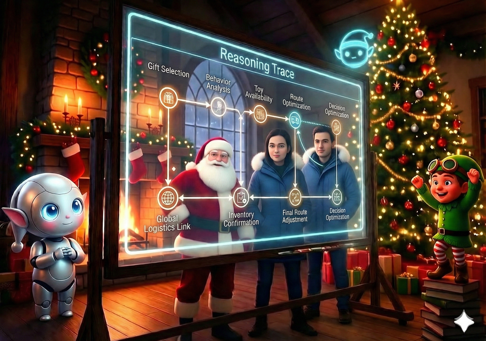

# Day 24: "Why Did You Buy Coal?" (Explainability via Agent Core)

## The Story

The North Pole was unusually quiet for the twenty-fourth of December. The frantic scratching of quills and the rhythmic clatter of old-fashioned sorting machines had been replaced by the soft, rhythmic hum of the Agent Core. Santa sat in his high-tech office, the warm glow of the fireplace dancing on the walls, while the cool blue light of holographic displays illuminated his thoughtful face.

Beside him, the Apprentice watched as thousands of decisions flickered across the screens—each one a life, a wish, a moment of Christmas magic.

"It happens every year," Santa said softly, his voice carrying the weight of centuries. "A parent calls. They are angry, or confused, or simply heartbroken. 'Why did my child get coal?' they ask. In the old days, I would shrug and mutter something about the elves' bookkeeping. But this year... this year is different."

A sharp chime echoed through the room. A new complaint had arrived: Case #123. A parent was demanding to know why their child, who had specifically asked for a "Super-Fast Racing Drone," had received a lump of coal instead.

Rudy appeared on the main display, his digital circuit patterns pulsing with a nervous green light. "Sir, Case #123 is... complicated. The child's letter was quite polite, but the behavior history retrieved from the Vector Store showed a series of 'unfortunate incidents' involving a neighbor's cat and a garden hose."

Elfie chimed in, his voice buzzing with excitement. "And I checked the safety constraints! A 'Super-Fast Racing Drone' in a neighborhood with so many cats? The risk-to-joy ratio was completely off the charts!"

Santa smiled, but it was a serious smile. "You see, Apprentice? The Agent Core didn't just store the data. It stored the *intent*. It stored the reasoning. It stored the very soul of the decision."

He gestured to the holographic reasoning trace. "We don't just tell them 'no'. We show them *why*. We reconstruct the path from the letter to the history, through the ethical reasoning of Rudy and the safety checks of Elfie, right down to the final decision. This isn't just a log; it's an audit trail of trust."

"So," the Apprentice asked, "we're going to explain the 'why' behind the coal?"

"Exactly," Santa replied, his eyes twinkling. "Because in the Great Cloud Migration, transparency is the greatest gift of all."

## Learning Goal: Explainability via Agent Core

Today’s focus is on **AI Explainability and Reasoning Traces**. In complex multi-agent systems, it’s not enough to get the right answer; you must be able to explain *how* the system arrived at that answer. By using the **Agent Core** as a central memory layer, we can reconstruct the entire decision-making process—from initial input to final output—including all intermediate reasoning steps, tool calls, and agent interactions.

Key concepts include:
*   **Reasoning Traces**: Capturing the "thought process" of the agents.
*   **Decision-Level Observability**: Moving beyond raw logs to human-readable explanations.
*   **Audit Trails**: Maintaining a permanent record of intent and outcomes for trust and safety.

## Participant Challenge

Participants will practice today’s capability using the materials provided for this day. They will apply today’s skills within the included environment to:
1.  Query the Agent Core for the execution trace of Case #123.
2.  Reconstruct the reasoning chain involving the letter content, behavior history, and safety constraints.
3.  Generate a human-readable "Explanation Report" that justifies the decision to provide coal instead of the requested gift.

## Cost-Saving & Practical Tips

*   **Filter for Relevance**: When reconstructing traces, only extract the nodes that directly contributed to the final decision to save on processing tokens.
*   **Use Summarization**: Use a smaller model to summarize raw reasoning steps into a human-readable format.
*   **Cache Common Explanations**: If multiple cases share similar reasoning (e.g., safety violations), cache the explanation templates to reduce redundant generation.

## Tomorrow’s Teaser

The final countdown begins as 100,000 letters hit the system at once—will the Agent Core hold under the ultimate pressure of Christmas Eve?

