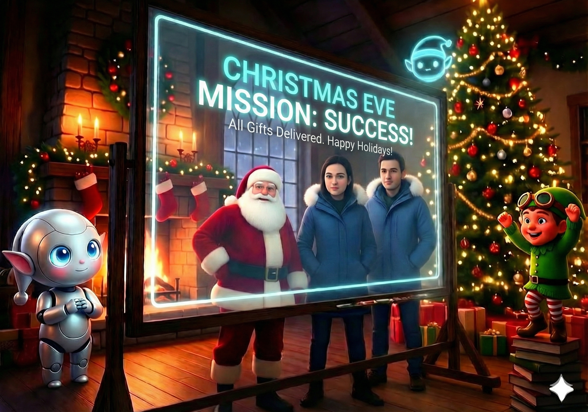

# Day 25: The Night Before Christmas (Agent Core at Scale)

## The Story

The air in the North Pole Command Center crackled with a static charge that had nothing to do with the weather. It was the energy of a hundred thousand minds working as one. Outside, the aurora borealis pulsed in rhythmic waves of violet and gold, mirroring the data streams that flowed through the massive, glowing sphere of the Agent Core at the room's center.

It was December 24th. The Final Run.

Santa stood at the great crystal window, his hands clasped behind his back. He looked not at the sleigh being loaded by silent, efficient robotic arms, but at the reflection of the Command Center in the glass.

"Look at them, Apprentice," Santa whispered.

Rudy and Elfie were no longer just two agents; they were a symphony. Rudy sat at a console of light, his fingers dancing as he managed the global plan. He wasn't just processing one letter; he was coordinating the desires of an entire planet. He knew which decisions could be shared, which gifts were in short supply, and exactly when to pause for a human heart to intervene.

Elfie was a blur of motion, his digital form flickering as he executed tools across a dozen time zones simultaneously. He searched inventories, validated safety protocols, and updated the Agent Core with the precision of a master watchmaker.

There was no panic. There were no "workflows" to break, no rigid pipelines to clog. There was only emergent coordination. When a massive PDF arrived from a school in Toronto, the Agent Core recognized the patterns and reused the reasoning from a similar batch in Vancouver. When a vague wish for "something magical" came from a lonely child in the Alps, Rudy paused, consulted the child's history, and chose a gift that spoke to their soul.

"We did it," the Apprentice said, standing beside Santa. "The Great Cloud Migration is complete."

Santa turned, his eyes bright with a joy that transcended technology. "We didn't just move to the cloud, my friend. We built a heart for it. A system that doesn't just calculate, but understands. A system that doesn't just work, but cares."

The final chime sounded. 43,492 cases: Processed. 43,492 gifts: Manifested. 43,492 children: Known.

Santa picked up his hat, the red velvet rich and deep in the Command Center's light. "Come, Apprentice. The sleigh is ready, the Agent Core is steady, and the world is waiting."

As they walked toward the hangar, the Agent Core pulsed one last time—a steady, warm heartbeat of light. Christmas was saved, not by a miracle, but by the perfect harmony of magic and machine.

## Learning Goal: Agent Core at Scale

Today is the culmination of the entire journey: **Scaling Multi-Agent Systems with Agent Core**. We move from individual cases to massive, real-world volume. The challenge is to maintain consistency, resilience, and efficiency when processing 43,492 complex, multimodal inputs simultaneously.

Key concepts include:
*   **Emergent Coordination**: How agents interact through shared state without hard-coded handoffs.
*   **Context Reuse at Scale**: Leveraging previous decisions and patterns to reduce latency and cost.
*   **Resilient Execution**: Ensuring the system can handle massive bursts of data without losing state or accuracy.

## Participant Challenge

Participants will practice today’s capability using the materials provided for this day. They will apply today’s skills within the included environment to:
1.  Process a "Mega Batch" of mixed inputs (letters, images, metadata).
2.  Implement a coordination loop where Rudy plans and Elfie executes across multiple cases.
3.  Generate a final `delivery_manifest.csv` that summarizes every decision made by the system.
4.  Produce a `system_health_summary.md` reflecting on the stability and trust of the Agent Core.

## Cost-Saving & Practical Tips

*   **Batch Processing**: Group similar requests together to maximize context reuse and minimize model calls.
*   **Aggressive Caching**: Use the Agent Core's memory to cache validated tool outputs and common reasoning patterns.
*   **Dynamic Throttling**: Implement logic to scale agent activity based on available budget and time constraints.

## Tomorrow’s Teaser

Merry Christmas to all, and to all a great Cloud-mas!

